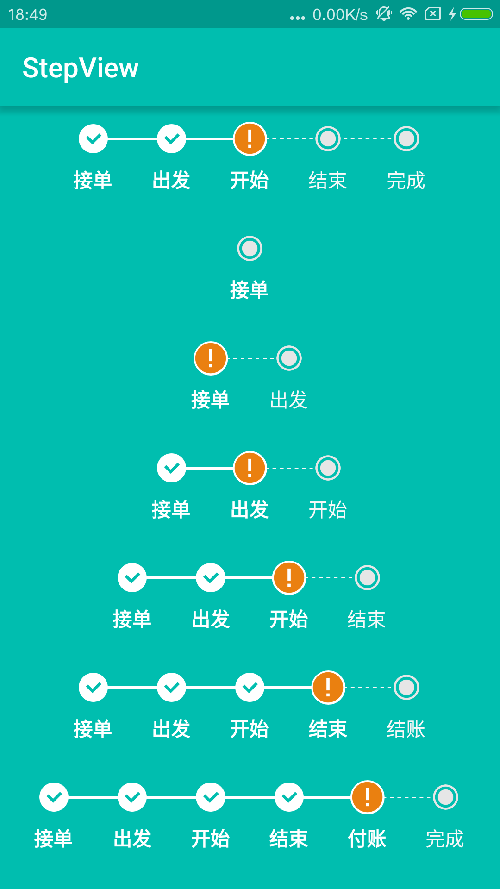

# StepView
Step by step，流程指示器。

</img>

##snapshot
</img>

##how to use

Add it in your root build.gradle at the end of repositories:

	repositories {
			...
			maven { url "https://jitpack.io" }
		}
Step 2. Add the dependency
	
	dependencies {
	        compile 'com.github.baoyachi:StepView:v1.0'
	}		
		
		


in xml

```java
	<com.baoyachi.stepview.StepView
            android:id="@+id/step_view0"
            android:layout_width="match_parent"
            android:layout_height="wrap_content"
            android:layout_centerInParent="true"
            android:textColor="@android:color/white"
            android:textSize="14sp"
            />
```
use code

```java
StepView setpview0 = (StepView) findViewById(R.id.step_view0);
        List<String> list0 = new ArrayList<>();
        list0.add("接单");
        list0.add("出发");
        list0.add("开始");
        list0.add("结束");
        list0.add("完成");
        setpview0.setStepsViewIndicatorComplectingPosition(2)//设置完成的步数
                .setStepViewTexts(list0)//总步骤
                .setStepsViewIndicatorCompletedLineColor(ContextCompat.getColor(getBaseContext(), android.R.color.white))//设置StepsViewIndicator完成线的颜色
                .setStepsViewIndicatorUnCompletedLineColor(ContextCompat.getColor(getBaseContext(), R.color.uncompleted_text_color))//设置StepsViewIndicator未完成线的颜色
                .setStepViewComplectedTextColor(ContextCompat.getColor(getBaseContext(), android.R.color.white))//设置StepsView text完成线的颜色
                .setStepViewUnComplectedTextColor(ContextCompat.getColor(getBaseContext(), R.color.uncompleted_text_color))//设置StepsView text未完成线的颜色
                .setStepsViewIndicatorCompleteIcon(ContextCompat.getDrawable(getBaseContext(), R.drawable.complted))//设置StepsViewIndicator CompleteIcon
                .setStepsViewIndicatorDefaultIcon(ContextCompat.getDrawable(getBaseContext(), R.drawable.default_icon))//设置StepsViewIndicator DefaultIcon
                .setStepsViewIndicatorAttentionIcon(ContextCompat.getDrawable(getBaseContext(), R.drawable.attention));//设置StepsViewIndicator AttentionIcon
```
Use So Simple!!!


##Introduction
现在,绝大部分公司对于一个项目订单流程控制不外乎从订单的初始状态到订单完成的状态，总结起来就是关于一个物体（订单/工单）状态变化的事物属性。所以就有了下面类似图片的效果，从订单的初始状态到订单完成。一个好的流程展示，对于工作效率的提高尤其的关键。该库代码看起来简洁，加上了详细的备注，看起来不会那么枯燥，也方便定制。那么废话不多说，直接进入正题。


##preview
可能当前的StepView展示的点是动态的，有时候是两个，有时候是三个，有时候是四个甚至五个六个，之前有想过展示成下面的效果。
</img>

但是当stepview的个数为2时效果太丑，一个距最左边，一个距左右边。能不忍，改吧，改了变成下面的效果
</img>

上下对比下是不是好看了很多呢。

##What can be learned about this page
好了，我们通过这篇文章可以学习哪些知识呢？

* 自定义控件的加强
* Canvas，Paint的使用
* 如何绘制矩形
* 如何绘制虚线
* 如何绘制圆
* 加上小小的数学计算，哈哈，开个小玩笑，学过数学，应该不成问题！

##start-pre
写这个开源项目前的热身

* 首先我们来画一个矩形

```java
public class RectView extends View
    {

        public RectView(Context context)
        {
            super(context);
        }

        @Override
        protected void onDraw(Canvas canvas)
        {

            super.onDraw(canvas);
            setBackgroundResource(R.drawable.default_bg);//设置背景色

            //----绘制矩形------------
            Paint paint = new Paint();// 定义画笔
            paint.setStyle(Paint.Style.FILL);//设置实心
            paint.setAntiAlias(true);// 消除锯齿
            paint.setColor(Color.WHITE);//设置画笔颜色
            paint.setStrokeWidth(40);// 设置paint的外框宽度
            canvas.drawRect(200, 200, 800, 220, paint);//绘制矩形
            //----绘制矩形------------
          }
      }
}
```
如下图：绘制矩形，因为绘制矩形需要知道左上又下四个点的坐标。
我们设置好四个点的坐标，绘制如下图
</img>

接上面绘制圆


```java
            //----绘制圆---------------------
            canvas.drawCircle(350, 350, 100, paint);
            //----绘制圆---------------------
```
因为绘制圆需要圆点和半径，定义好后，展示如下：
</img>


接着绘制虚线

```java
            //----绘制虚线---------------------
            Paint pathPaint = new Paint();
            pathPaint.setAntiAlias(true);
            pathPaint.setColor(Color.WHITE);
            pathPaint.setStyle(Paint.Style.STROKE);
            pathPaint.setStrokeWidth(2);
            DashPathEffect mEffects = new DashPathEffect(new float[]{8, 8, 8, 8}, 1);
            Path path = new Path();
            path.moveTo(200, 600);
            path.lineTo(800, 600);
            pathPaint.setPathEffect(mEffects);
            canvas.drawPath(path, pathPaint);
            //----绘制虚线---------------------
        }
    }
```
这里用到一个新控件

DashPathEffect:DashPathEffect是PathEffect类的一个子类,可以使paint画出类似虚线的样子,并且可以任意指定虚实的排列方式.
好了，我们通过canvas.drawPath(path, pathPaint)绘制如下图
</img>

难点说完了，我们就开始我们的项目吧。


##构成
我们拿这个局部图来做栗子:

###因此整个这一张图是一个组合控件，
</img>

```java

<?xml version="1.0" encoding="utf-8"?>
<LinearLayout xmlns:android="http://schemas.android.com/apk/res/android"
              android:layout_width="match_parent"
              android:layout_height="match_parent"
              android:orientation="vertical">

    <com.baoyachi.stepview.StepsViewIndicator
        android:id="@+id/steps_indicator"
        android:layout_width="match_parent"
        android:layout_height="wrap_content"
        android:layout_marginTop="4dp"/>

    <RelativeLayout
        android:id="@+id/rl_text_container"
        android:layout_width="match_parent"
        android:layout_height="wrap_content"
        />
</LinearLayout>
```

####上面是我们自定义的StepsViewIndicator，</img>
####下面是我们展示的文字,因为是多个文字组合，我们下面应该是一个ViewGroup容器</img>

###分析：
* 如何做到居中显示

	1.首先得到该控件的宽度。

	2.其次得到当前控件距离最左边值。然后计算当前有几个圆，几个条线？这个是外部传递进来的，告诉该控件当前共有几个步骤，并且当前正在执行到哪一步？

  当前控件距离最左边值，定义为：paddingLeft；  
  当前控件的宽度：getWidth()；            
  圆的半径：mCircleRadius；            
  两条线之前的padding值：mLinePadding；

这么说可能不怎么明白，举个‘栗子’。

1.假设当前共有一步：	接单。
意味当前有一个圆，没有连线，得出paddingLeft

    float paddingLeft= getWidth() - 1*(mCircleRadius*2)-0*mLinePadding；

2.假设当前共有二步：接单->打包
意味当前有两个圆，之前有一条连线，得出paddingLeft

    float paddingLeft= getWidth() - 2*(mCircleRadius*2)-1*mLinePadding；
3.假设当前共有三步：接单->打包->出发
意味当前有三个圆，之前有二条连线，得出paddingLeft

    float paddingLeft= getWidth() - 3*(mCircleRadius*2)-2*mLinePadding；

4.假设当前共有四步：接单->打包->出发->送单
意味当前有四个圆，之前有三条连线，得出paddingLeft

    float paddingLeft= getWidth() - 4*(mCircleRadius*2)-3*mLinePadding；

5.假设当前共有五步：接单->打包->出发->送单->完成

意味着我当前有五个圆，五个圆中间有四条线相连接，这样我们可以得到五个圆的直径+四条线的长度，这样我们就可以得到最左边的paddingLeft的值：

    float paddingLeft= getWidth() - 5*(mCircleRadius*2)-4*mLinePadding；
综上所述：
  得出一个计算公式：其中mStepNum：当前控件所展示的步数。

	float paddingLeft = (getWidth() - mStepNum * mCircleRadius * 2 - (mStepNum - 1) * mLinePadding) / 2;
所以，paddingLeft就可以动态展示出来，这样我们就可以知道所有步数对应圆的中心点的位置了：其中mComplectedXPosition为装所有圆中心点的集合。
```java
  for(int i = 0; i < mStepNum; i++)
  {
      //先计算全部最左边的padding值（getWidth()-（圆形直径+两圆之间距离）*2）
      float paddingLeft = (getWidth() - mStepNum * mCircleRadius * 2 - (mStepNum - 1) * mLinePadding) / 2;
      mComplectedXPosition.add(paddingLeft + mCircleRadius + i * mCircleRadius * 2 + i * mLinePadding);
  }
```

##Global graph 我们先来看下面这张动态全局预览图.
我们来看下全局预览图，当前StepView的展示是根据StepView的位置动态调整的。
</img>

是不是有了上面的小知识点的引导，这张图看起后，是不是思路就清晰许多了呢!是的，StepView本身就是有图片矩形和虚线绘制而成，下面我们进行拆分。
一步步解析。


###第一步 init() 初始化

因为该view分为完成块和未完成块，因此，init()主要是在做一些初始化的信息设置

```java
    private void init()
	{
		 mPath = new Path();
        mEffects = new DashPathEffect(new float[]{8, 8, 8, 8}, 1);

        mComplectedXPosition = new ArrayList<>();//初始化
		 //设置未完成mUnCompletedPaint的初始化设置
        mUnCompletedPaint = new Paint();
        mCompletedPaint = new Paint();
        mUnCompletedPaint.setAntiAlias(true);
        mUnCompletedPaint.setColor(mUnCompletedLineColor);
        mUnCompletedPaint.setStyle(Paint.Style.STROKE);
        mUnCompletedPaint.setStrokeWidth(2);

		 //设置完成mCompletedPaint的初始化设置
        mCompletedPaint.setAntiAlias(true);
        mCompletedPaint.setColor(mCompletedLineColor);
        mCompletedPaint.setStyle(Paint.Style.STROKE);
        mCompletedPaint.setStrokeWidth(2);
        mUnCompletedPaint.setPathEffect(mEffects);
        mCompletedPaint.setStyle(Paint.Style.FILL);
        .
        .
        .
    }
```

* 定义已完成成线(矩形)mCompletedLineHeight的高度：

    mCompletedLineHeight = 0.05f * defaultStepIndicatorNum;
* 定义圆的半径：
		mCircleRadius = 0.28f * defaultStepIndicatorNum;
* 定义线与线之前的间距
        mLinePadding = 0.85f * defaultStepIndicatorNum;//线与线之间的间距
不要问我这线是怎么算出来的，我也是慢慢调出来的！！！

* 定义三个状态的图片

		mCompleteIcon = ContextCompat.getDrawable(getContext(), R.drawable.complted);//已经完成的icon
        mAttentionIcon = ContextCompat.getDrawable(getContext(), R.drawable.attention);//正在进行的icon
        mDefaultIcon = ContextCompat.getDrawable(getContext(), R.drawable.default_icon);//未完成的icon

###第二步
* onMeasure()
哈哈，好熟悉的方法，这里的作用为了测量自身宽和高

```java
		@Override
	    protected synchronized void onMeasure(int widthMeasureSpec, int heightMeasureSpec)
	    {
	        int width = defaultStepIndicatorNum * 2;
	        if(MeasureSpec.UNSPECIFIED != MeasureSpec.getMode(widthMeasureSpec))
	        {
	            width = MeasureSpec.getSize(widthMeasureSpec);
	        }
	        int height = defaultStepIndicatorNum;
	        if(MeasureSpec.UNSPECIFIED != MeasureSpec.getMode(heightMeasureSpec))
	        {
	            height = Math.min(height, MeasureSpec.getSize(heightMeasureSpec));
	        }
	        setMeasuredDimension(width, height);
	    }
```

###第三步 onSizeChanged(int w, int h, int oldw, int oldh)
动态计算当前view的位置,这里的计算paddingLeft和mComplectedXPosition的方法已经在前面详细说明

```java		
    @Override
    protected void onSizeChanged(int w, int h, int oldw, int oldh)
    {
        super.onSizeChanged(w, h, oldw, oldh);
        //获取中间的高度
        mCenterY = 0.5f * getHeight();
        //获取左上方Y的位置，获取该点的意义是为了方便画矩形左上的Y位置
        mLeftY = mCenterY - (mCompletedLineHeight / 2);
        //获取右下方Y的位置，获取该点的意义是为了方便画矩形右下的Y位置
        mRightY = mCenterY + mCompletedLineHeight / 2;

        for(int i = 0; i < mStepNum; i++)
        {
            //先计算全部最左边的padding值（getWidth()-（圆形直径+两圆之间距离）*2）
            float paddingLeft = (getWidth() - mStepNum * mCircleRadius * 2 - (mStepNum - 1) * mLinePadding) / 2;
            mComplectedXPosition.add(paddingLeft + mCircleRadius + i * mCircleRadius * 2 + i * mLinePadding);
        }
		//当位置发生改变时的回调监听
        mOnDrawListener.ondrawIndicator();
    }
```
这里onSizeChanged（）方法里取mLeftY，mRightY是为了方便之后画矩形。

###第四步 protected synchronized void onDraw(Canvas canvas)
重重之重的方法来了，就会绘制该view所调用的方法，我们来看代码

```java

	@Override
    protected synchronized void onDraw(Canvas canvas)
    {
        super.onDraw(canvas);
        mUnCompletedPaint.setColor(mUnCompletedLineColor);
        mCompletedPaint.setColor(mCompletedLineColor);

        //-----------------------画线---------------------------------------------------------------
        for(int i = 0; i < mComplectedXPosition.size() - 1; i++)
        {
            //前一个ComplectedXPosition
            final float preComplectedXPosition = mComplectedXPosition.get(i);
            //后一个ComplectedXPosition
            final float afterComplectedXPosition = mComplectedXPosition.get(i + 1);

            if(i < mComplectingPosition)//判断在完成之前的所有点
            {
                //判断在完成之前的所有点，画完成的线，这里是矩形
                canvas.drawRect(preComplectedXPosition + mCircleRadius - 10, mLeftY, afterComplectedXPosition - mCircleRadius + 10, mRightY, mCompletedPaint);
            } else
            {
                mPath.moveTo(preComplectedXPosition + mCircleRadius, mCenterY);
                mPath.lineTo(afterComplectedXPosition - mCircleRadius, mCenterY);
                canvas.drawPath(mPath, mUnCompletedPaint);
            }
        }
        //-----------------------画线---------------------------------------------------------------


        //-----------------------画图标--------------------------------------------------------------
        for(int i = 0; i < mComplectedXPosition.size(); i++)
        {
            final float currentComplectedXPosition = mComplectedXPosition.get(i);
            Rect rect = new Rect((int) (currentComplectedXPosition - mCircleRadius), (int) (mCenterY - mCircleRadius), (int) (currentComplectedXPosition + mCircleRadius), (int) (mCenterY + mCircleRadius));
            if(i < mComplectingPosition)
            {
                mCompleteIcon.setBounds(rect);
                mCompleteIcon.draw(canvas);
            } else if(i == mComplectingPosition && mComplectedXPosition.size() != 1)
            {
                mCompletedPaint.setColor(Color.WHITE);
                canvas.drawCircle(currentComplectedXPosition, mCenterY, mCircleRadius * 1.1f, mCompletedPaint);
                mAttentionIcon.setBounds(rect);
                mAttentionIcon.draw(canvas);
            } else
            {
                mDefaultIcon.setBounds(rect);
                mDefaultIcon.draw(canvas);
            }
        }
        //-----------------------画图标--------------------------------------------------------------
    }
```

我们来看，在onDraw()方法里，主要是做了两部分事情
* 画线
这里我们拿到前一个圆的位置preComplectedXPosition和后一个圆心的位置afterComplectedXPosition，然后进行判断，小于当前正在进行的点，画完成的线，我们这里用绘制矩形样式表示。大于当前正在进行的点，画虚线。

```java

	//-----------------------画线---------------------------------------------------------------
        for(int i = 0; i < mComplectedXPosition.size() - 1; i++)
        {
            //前一个ComplectedXPosition
            final float preComplectedXPosition = mComplectedXPosition.get(i);
            //后一个ComplectedXPosition
            final float afterComplectedXPosition = mComplectedXPosition.get(i + 1);

            if(i < mComplectingPosition)//判断在完成之前的所有点
            {
                //判断在完成之前的所有点，画完成的线，这里是矩形
                canvas.drawRect(preComplectedXPosition + mCircleRadius - 10, mLeftY, afterComplectedXPosition - mCircleRadius + 10, mRightY, mCompletedPaint);
            } else
            {
                mPath.moveTo(preComplectedXPosition + mCircleRadius, mCenterY);
                mPath.lineTo(afterComplectedXPosition - mCircleRadius, mCenterY);
                canvas.drawPath(mPath, mUnCompletedPaint);
            }
        }
```
这里细心的小伙伴可能有注意到，为什么在画线的的时候，为什么canvas.drawRect的时候，左右会分别-10，+10
		
		canvas.drawRect(preComplectedXPosition + mCircleRadius - 10, mLeftY, afterComplectedXPosition - mCircleRadius + 10, mRightY, mCompletedPaint);
那是因为当画矩形时，线和圆之间的连接像是有缝隙，于是我就让矩形在往左边多画了10单位，在右边多画了10单位，这样他们看起来像是无缝连接一样。哈哈，但是这间距不能太大。		
	

* 画圆
这里判断小于正在进行中的为则表示已经完成。并且刚好等于正在进行中的且不等于一表示正在进行中，大于则表示该步骤为完成,分别绘制图标。

```java

	//-----------------------画图标--------------------------------------------------------------
        for(int i = 0; i < mComplectedXPosition.size(); i++)
        {
            final float currentComplectedXPosition = mComplectedXPosition.get(i);
            Rect rect = new Rect((int) (currentComplectedXPosition - mCircleRadius), (int) (mCenterY - mCircleRadius), (int) (currentComplectedXPosition + mCircleRadius), (int) (mCenterY + mCircleRadius));
            if(i < mComplectingPosition)
            {
                mCompleteIcon.setBounds(rect);
                mCompleteIcon.draw(canvas);
            } else if(i == mComplectingPosition && mComplectedXPosition.size() != 1)
            {
                mCompletedPaint.setColor(Color.WHITE);
                canvas.drawCircle(currentComplectedXPosition, mCenterY, mCircleRadius * 1.1f, mCompletedPaint);
                mAttentionIcon.setBounds(rect);
                mAttentionIcon.draw(canvas);
            } else
            {
                mDefaultIcon.setBounds(rect);
                mDefaultIcon.draw(canvas);
            }
        }
        //-----------------------画图标--------------------------------------------------------------
```


###StepsViewIndicator的其他方法
```java
	 /**
     * 得到所有圆点所在的位置
     *
     * @return
     */
    public List<Float> getComplectedXPosition()
    {
        return mComplectedXPosition;
    }

    /**
     * 设置流程步数
     *
     * @param stepNum 流程步数
     */
    public void setStepNum(int stepNum)
    {
        this.mStepNum = stepNum;
        invalidate();
    }

    /**
     * 设置正在进行position
     *
     * @param complectingPosition
     */
    public void setComplectingPosition(int complectingPosition)
    {
        this.mComplectingPosition = complectingPosition;
        invalidate();
    }

    /**
     * 设置未完成线的颜色
     *
     * @param unCompletedLineColor
     */
    public void setUnCompletedLineColor(int unCompletedLineColor)
    {
        this.mUnCompletedLineColor = unCompletedLineColor;
    }

    /**
     * 设置已完成线的颜色
     *
     * @param completedLineColor
     */
    public void setCompletedLineColor(int completedLineColor)
    {
        this.mCompletedLineColor = completedLineColor;
    }

    /**
     * 设置默认图片
     *
     * @param defaultIcon
     */
    public void setDefaultIcon(Drawable defaultIcon)
    {
        this.mDefaultIcon = defaultIcon;
    }

    /**
     * 设置已完成图片
     * @param completeIcon
     */
    public void setCompleteIcon(Drawable completeIcon)
    {
        this.mCompleteIcon = completeIcon;
    }

    /**
     * 设置正在进行中的图片
     * @param attentionIcon
     */
    public void setAttentionIcon(Drawable attentionIcon)
    {
        this.mAttentionIcon = attentionIcon;
    }
```


##StepsViewIndicator (全部代码)
```java
public class StepsViewIndicator extends View
{

    //定义默认的高度
    private int defaultStepIndicatorNum = (int) TypedValue.applyDimension(TypedValue.COMPLEX_UNIT_DIP, 40, getResources().getDisplayMetrics());

    private float mCompletedLineHeight;//完成线的高度
    private float mCircleRadius;//圆的半径

    private Drawable mCompleteIcon;//完成的默认图片
    private Drawable mAttentionIcon;//正在进行的默认图片
    private Drawable mDefaultIcon;//默认的背景图
    private float mCenterY;//该view的中间位置
    private float mLeftY;//左上方的Y位置
    private float mRightY;//右下方的位置

    private int mStepNum = 0;//当前有几部流程
    private float mLinePadding;

    private List<Float> mComplectedXPosition;//定义完成时当前view在左边的位置
    private Paint mUnCompletedPaint;//未完成Paint
    private Paint mCompletedPaint;//完成paint
    private int mUnCompletedLineColor = ContextCompat.getColor(getContext(), R.color.uncompleted_color);//定义默认未完成线的颜色
    private int mCompletedLineColor = Color.WHITE;//定义默认完成线的颜色
    private PathEffect mEffects;

    private int mComplectingPosition;//正在进行position
    private Path mPath;

    private OnDrawIndicatorListener mOnDrawListener;

    /**
     * 设置监听
     *
     * @param onDrawListener
     */
    public void setOnDrawListener(OnDrawIndicatorListener onDrawListener)
    {
        mOnDrawListener = onDrawListener;
    }

    /**
     * get小圆的半径
     *
     * @return
     */
    public float getCircleRadius()
    {
        return mCircleRadius;
    }

    public StepsViewIndicator(Context context)
    {
        this(context, null);
    }

    public StepsViewIndicator(Context context, AttributeSet attrs)
    {
        this(context, attrs, 0);
    }

    public StepsViewIndicator(Context context, AttributeSet attrs, int defStyle)
    {
        super(context, attrs, defStyle);
        init();
    }

    /**
     * init
     */
    private void init()
    {
        mPath = new Path();
        mEffects = new DashPathEffect(new float[]{8, 8, 8, 8}, 1);

        mComplectedXPosition = new ArrayList<>();//初始化

        mUnCompletedPaint = new Paint();
        mCompletedPaint = new Paint();
        mUnCompletedPaint.setAntiAlias(true);
        mUnCompletedPaint.setColor(mUnCompletedLineColor);
        mUnCompletedPaint.setStyle(Paint.Style.STROKE);
        mUnCompletedPaint.setStrokeWidth(2);

        mCompletedPaint.setAntiAlias(true);
        mCompletedPaint.setColor(mCompletedLineColor);
        mCompletedPaint.setStyle(Paint.Style.STROKE);
        mCompletedPaint.setStrokeWidth(2);

        mUnCompletedPaint.setPathEffect(mEffects);
        mCompletedPaint.setStyle(Paint.Style.FILL);

        //已经完成线的宽高
        mCompletedLineHeight = 0.05f * defaultStepIndicatorNum;
        //圆的半径
        mCircleRadius = 0.28f * defaultStepIndicatorNum;
        //线与线之间的间距
        mLinePadding = 0.85f * defaultStepIndicatorNum;

        mCompleteIcon = ContextCompat.getDrawable(getContext(), R.drawable.complted);//已经完成的icon
        mAttentionIcon = ContextCompat.getDrawable(getContext(), R.drawable.attention);//正在进行的icon
        mDefaultIcon = ContextCompat.getDrawable(getContext(), R.drawable.default_icon);//未完成的icon
    }

    @Override
    protected synchronized void onMeasure(int widthMeasureSpec, int heightMeasureSpec)
    {
        int width = defaultStepIndicatorNum * 2;
        if(MeasureSpec.UNSPECIFIED != MeasureSpec.getMode(widthMeasureSpec))
        {
            width = MeasureSpec.getSize(widthMeasureSpec);
        }
        int height = defaultStepIndicatorNum;
        if(MeasureSpec.UNSPECIFIED != MeasureSpec.getMode(heightMeasureSpec))
        {
            height = Math.min(height, MeasureSpec.getSize(heightMeasureSpec));
        }
        setMeasuredDimension(width, height);
    }

    @Override
    protected void onSizeChanged(int w, int h, int oldw, int oldh)
    {
        super.onSizeChanged(w, h, oldw, oldh);
        //获取中间的高度
        mCenterY = 0.5f * getHeight();
        //获取左上方Y的位置，获取该点的意义是为了方便画矩形左上的Y位置
        mLeftY = mCenterY - (mCompletedLineHeight / 2);
        //获取右下方Y的位置，获取该点的意义是为了方便画矩形右下的Y位置
        mRightY = mCenterY + mCompletedLineHeight / 2;

        for(int i = 0; i < mStepNum; i++)
        {
            //先计算全部最左边的padding值（getWidth()-（圆形直径+两圆之间距离）*2）
            float paddingLeft = (getWidth() - mStepNum * mCircleRadius * 2 - (mStepNum - 1) * mLinePadding) / 2;
            mComplectedXPosition.add(paddingLeft + mCircleRadius + i * mCircleRadius * 2 + i * mLinePadding);
        }

        mOnDrawListener.ondrawIndicator();
    }

    @Override
    protected synchronized void onDraw(Canvas canvas)
    {
        super.onDraw(canvas);
        mUnCompletedPaint.setColor(mUnCompletedLineColor);
        mCompletedPaint.setColor(mCompletedLineColor);

        //-----------------------画线---------------------------------------------------------------
        for(int i = 0; i < mComplectedXPosition.size() - 1; i++)
        {
            //前一个ComplectedXPosition
            final float preComplectedXPosition = mComplectedXPosition.get(i);
            //后一个ComplectedXPosition
            final float afterComplectedXPosition = mComplectedXPosition.get(i + 1);

            if(i < mComplectingPosition)//判断在完成之前的所有点
            {
                //判断在完成之前的所有点，画完成的线，这里是矩形
                canvas.drawRect(preComplectedXPosition + mCircleRadius - 10, mLeftY, afterComplectedXPosition - mCircleRadius + 10, mRightY, mCompletedPaint);
            } else
            {
                mPath.moveTo(preComplectedXPosition + mCircleRadius, mCenterY);
                mPath.lineTo(afterComplectedXPosition - mCircleRadius, mCenterY);
                canvas.drawPath(mPath, mUnCompletedPaint);
            }
        }
        //-----------------------画线---------------------------------------------------------------


        //-----------------------画图标--------------------------------------------------------------
        for(int i = 0; i < mComplectedXPosition.size(); i++)
        {
            final float currentComplectedXPosition = mComplectedXPosition.get(i);
            Rect rect = new Rect((int) (currentComplectedXPosition - mCircleRadius), (int) (mCenterY - mCircleRadius), (int) (currentComplectedXPosition + mCircleRadius), (int) (mCenterY + mCircleRadius));
            if(i < mComplectingPosition)
            {
                mCompleteIcon.setBounds(rect);
                mCompleteIcon.draw(canvas);
            } else if(i == mComplectingPosition && mComplectedXPosition.size() != 1)
            {
                mCompletedPaint.setColor(Color.WHITE);
                canvas.drawCircle(currentComplectedXPosition, mCenterY, mCircleRadius * 1.1f, mCompletedPaint);
                mAttentionIcon.setBounds(rect);
                mAttentionIcon.draw(canvas);
            } else
            {
                mDefaultIcon.setBounds(rect);
                mDefaultIcon.draw(canvas);
            }
        }
        //-----------------------画图标--------------------------------------------------------------
    }

    /**
     * 得到所有圆点所在的位置
     *
     * @return
     */
    public List<Float> getComplectedXPosition()
    {
        return mComplectedXPosition;
    }

    /**
     * 设置流程步数
     *
     * @param stepNum 流程步数
     */
    public void setStepNum(int stepNum)
    {
        this.mStepNum = stepNum;
        invalidate();
    }

    /**
     * 设置正在进行position
     *
     * @param complectingPosition
     */
    public void setComplectingPosition(int complectingPosition)
    {
        this.mComplectingPosition = complectingPosition;
        invalidate();
    }

    /**
     * 设置未完成线的颜色
     *
     * @param unCompletedLineColor
     */
    public void setUnCompletedLineColor(int unCompletedLineColor)
    {
        this.mUnCompletedLineColor = unCompletedLineColor;
    }

    /**
     * 设置已完成线的颜色
     *
     * @param completedLineColor
     */
    public void setCompletedLineColor(int completedLineColor)
    {
        this.mCompletedLineColor = completedLineColor;
    }

    /**
     * 设置默认图片
     *
     * @param defaultIcon
     */
    public void setDefaultIcon(Drawable defaultIcon)
    {
        this.mDefaultIcon = defaultIcon;
    }

    /**
     * 设置已完成图片
     * @param completeIcon
     */
    public void setCompleteIcon(Drawable completeIcon)
    {
        this.mCompleteIcon = completeIcon;
    }

    /**
     * 设置正在进行中的图片
     * @param attentionIcon
     */
    public void setAttentionIcon(Drawable attentionIcon)
    {
        this.mAttentionIcon = attentionIcon;
    }


    /**
     * 设置对view监听
     */
    public interface OnDrawIndicatorListener
    {
        void ondrawIndicator();
    }
}
```


##StepView
好了StepsViewIndicator是不是已经完全熟悉了呢，下面我们看StepView.StepView其实组合控件，设置其子控件的属性，包括颜色，position的状态...其中有一个方法我们来看下，就是对于设置TextView的。

```java

	@Override
    public void ondrawIndicator()
    {
        List<Float> complectedXPosition = mStepsViewIndicator.getComplectedXPosition();
        if(mTexts != null)
        {
            for(int i = 0; i < mTexts.size(); i++)
            {
                TextView textView = new TextView(getContext());
                textView.setText(mTexts.get(i));
                textView.setX(complectedXPosition.get(i) - mStepsViewIndicator.getCircleRadius() - 10);//这里的-10是将文字进行调整居中，稍后再动态修改
                textView.setLayoutParams(new ViewGroup.LayoutParams(ViewGroup.LayoutParams.WRAP_CONTENT, ViewGroup.LayoutParams.WRAP_CONTENT));

                if(i <= mComplectingPosition)
                {
                    textView.setTypeface(null, Typeface.BOLD);
                    textView.setTextColor(mComplectedTextColor);
                } else
                {
                    textView.setTextColor(mUnComplectedTextColor);
                }

                mTextContainer.addView(textView);
            }
        }
    }
```
这里的ondrawIndicator()方法是在StepsViewIndicator的onSizeChanged（）引发的回调，来设置TextView

##StepView全部代码
```java
public class StepView extends LinearLayout implements StepsViewIndicator.OnDrawIndicatorListener
{

    private RelativeLayout mTextContainer;
    private StepsViewIndicator mStepsViewIndicator;
    private List<String> mTexts;
    private int mComplectingPosition;
    private int mUnComplectedTextColor = ContextCompat.getColor(getContext(), R.color.uncompleted_text_color);//定义默认未完成文字的颜色;
    private int mComplectedTextColor = ContextCompat.getColor(getContext(), android.R.color.white);//定义默认完成文字的颜色;


    public StepView(Context context)
    {
        this(context, null);
    }

    public StepView(Context context, AttributeSet attrs)
    {
        this(context, attrs, 0);
    }

    public StepView(Context context, AttributeSet attrs, int defStyleAttr)
    {
        super(context, attrs, defStyleAttr);
        init();
    }

    private void init()
    {
        View rootView = LayoutInflater.from(getContext()).inflate(R.layout.widget_stepsview, this);
        mStepsViewIndicator = (StepsViewIndicator) rootView.findViewById(R.id.steps_indicator);
        mStepsViewIndicator.setOnDrawListener(this);
        mTextContainer = (RelativeLayout) rootView.findViewById(R.id.rl_text_container);
        mTextContainer.removeAllViews();
    }

    /**
     * 设置显示的文字
     *
     * @param texts
     * @return
     */
    public StepView setStepViewTexts(List<String> texts)
    {
        mTexts = texts;
        mStepsViewIndicator.setStepNum(mTexts.size());
        return this;
    }

    /**
     * 设置正在进行的position
     *
     * @param complectingPosition
     * @return
     */
    public StepView setStepsViewIndicatorComplectingPosition(int complectingPosition)
    {
        mComplectingPosition = complectingPosition;
        mStepsViewIndicator.setComplectingPosition(complectingPosition);
        return this;
    }

    /**
     * 设置未完成文字的颜色
     *
     * @param unComplectedTextColor
     * @return
     */
    public StepView setStepViewUnComplectedTextColor(int unComplectedTextColor)
    {
        mUnComplectedTextColor = unComplectedTextColor;
        return this;
    }

    /**
     * 设置完成文字的颜色
     *
     * @param complectedTextColor
     * @return
     */
    public StepView setStepViewComplectedTextColor(int complectedTextColor)
    {
        this.mComplectedTextColor = complectedTextColor;
        return this;
    }

    /**
     * 设置StepsViewIndicator未完成线的颜色
     *
     * @param unCompletedLineColor
     * @return
     */
    public StepView setStepsViewIndicatorUnCompletedLineColor(int unCompletedLineColor)
    {
        mStepsViewIndicator.setUnCompletedLineColor(unCompletedLineColor);
        return this;
    }

    /**
     * 设置StepsViewIndicator完成线的颜色
     *
     * @param completedLineColor
     * @return
     */
    public StepView setStepsViewIndicatorCompletedLineColor(int completedLineColor)
    {
        mStepsViewIndicator.setCompletedLineColor(completedLineColor);
        return this;
    }

    /**
     * 设置StepsViewIndicator默认图片
     *
     * @param defaultIcon
     */
    public StepView setStepsViewIndicatorDefaultIcon(Drawable defaultIcon)
    {
        mStepsViewIndicator.setDefaultIcon(defaultIcon);
        return this;
    }

    /**
     * 设置StepsViewIndicator已完成图片
     *
     * @param completeIcon
     */
    public StepView setStepsViewIndicatorCompleteIcon(Drawable completeIcon)
    {
        mStepsViewIndicator.setCompleteIcon(completeIcon);
        return this;
    }

    /**
     * 设置StepsViewIndicator正在进行中的图片
     *
     * @param attentionIcon
     */
    public StepView setStepsViewIndicatorAttentionIcon(Drawable attentionIcon)
    {
        mStepsViewIndicator.setAttentionIcon(attentionIcon);
        return this;
    }


    @Override
    public void ondrawIndicator()
    {
        List<Float> complectedXPosition = mStepsViewIndicator.getComplectedXPosition();
        if(mTexts != null)
        {
            for(int i = 0; i < mTexts.size(); i++)
            {
                TextView textView = new TextView(getContext());
                textView.setText(mTexts.get(i));
                textView.setX(complectedXPosition.get(i) - mStepsViewIndicator.getCircleRadius() - 10);//这里的-10是将文字进行调整居中，稍后再动态修改
                textView.setLayoutParams(new ViewGroup.LayoutParams(ViewGroup.LayoutParams.WRAP_CONTENT, ViewGroup.LayoutParams.WRAP_CONTENT));

                if(i <= mComplectingPosition)
                {
                    textView.setTypeface(null, Typeface.BOLD);
                    textView.setTextColor(mComplectedTextColor);
                } else
                {
                    textView.setTextColor(mUnComplectedTextColor);
                }

                mTextContainer.addView(textView);
            }
        }
    }
}
```
好了，其实到了这里，基本上也要接近尾声了，其实这个控件看起来‘很复杂’，翻了翻代码，看了也没有多大难度，小伙伴们，只要静下心来，花点时间研究下，发现，也就是那么回事，只要努力，就会有收货。


###参考链接
[Android-StepsView](https://github.com/anton46/Android-StepsView)

##Thanks
* 感谢 [iconfont](http://iconfont.cn/) 提供的图片资源
* 感谢 [anton46](https://github.com/anton46/) 提供的源码作参考

###图片来源
* [step](http://iconfont.cn/search?q=step)
* [complted](http://iconfont.cn/search?q=right)
* [attention](http://iconfont.cn/search?q=attention)
* [default-icon](http://iconfont.cn/search?q=default)

##End
喜欢这个控件的小伙伴可以点击star哦！


